# Banco de dados

PostgreSQL é a fonte de verdade. IDs internos são UUID. Códigos e tokens públicos são aleatórios e não enumeráveis. Datas são armazenadas em UTC. Valores monetários são inteiros em centavos. A primeira migration assume banco vazio e não usa `db.create_all()`.

## Diagrama ER

```mermaid
erDiagram
  ADMIN_USERS ||--o{ USER_ROLES : possui
  ROLES ||--o{ USER_ROLES : concede
  ROLES ||--o{ ROLE_PERMISSIONS : possui
  PERMISSIONS ||--o{ ROLE_PERMISSIONS : concede
  ADMIN_USERS ||--o{ ADMIN_SESSIONS : inicia
  ADMIN_USERS ||--o{ AUDIT_LOGS : executa
  EVENT_EDITIONS ||--o{ REGISTRATIONS : recebe
  PARTICIPATION_CATEGORIES ||--o{ REGISTRATIONS : classifica
  REGISTRATIONS ||--o{ REGISTRATION_FILES : anexa
  REGISTRATIONS ||--o{ REGISTRATION_NOTES : recebe
  REGISTRATIONS ||--o{ REGISTRATION_STATUS_HISTORY : historico
  REGISTRATIONS ||--o| PROFILES : origina
  PROFILES ||--o{ PROFILE_CATEGORIES : possui
  PARTICIPATION_CATEGORIES ||--o{ PROFILE_CATEGORIES : classifica
  PROFILES ||--o{ PORTFOLIO_ASSETS : exibe
  COLLECTIONS ||--o{ PRODUCTS : agrupa
  PRODUCTS ||--o{ PRODUCT_VARIANTS : possui
  PRODUCTS ||--o{ PRODUCT_MEDIA : ilustra
  CARTS ||--o{ CART_ITEMS : contem
  PRODUCT_VARIANTS ||--o{ CART_ITEMS : seleciona
  CUSTOMERS ||--o{ ADDRESSES : possui
  CUSTOMERS ||--o{ ORDERS : realiza
  ORDERS ||--o{ ORDER_ITEMS : contem
  ORDERS ||--o{ PAYMENTS : recebe
  ORDERS ||--o{ FULFILLMENTS : entrega
  ORDERS ||--o{ ORDER_STATUS_HISTORY : historico
  PRODUCT_VARIANTS ||--o{ INVENTORY_MOVEMENTS : movimenta
  PRODUCT_VARIANTS ||--o{ INVENTORY_RESERVATIONS : reserva
  ARTWORKS ||--o{ ARTWORK_MEDIA : ilustra
  ARTWORKS ||--o| AUCTION_LOTS : oferece
  AUCTION_LOTS ||--o{ BIDS : recebe
  BIDDERS ||--o{ BIDS : realiza
  AUCTION_LOTS ||--o{ AUCTION_LOT_STATUS_HISTORY : historico
  GALLERY_ALBUMS ||--o{ GALLERY_MEDIA : contem
  EVENT_EDITIONS ||--o{ GALLERY_ALBUMS : documenta
  PARTNERS ||--o{ PARTNER_EDITIONS : apoia
  EVENT_EDITIONS ||--o{ PARTNER_EDITIONS : recebe
  CONTENT_ENTRIES ||--o{ CONTENT_VERSIONS : versiona
```

## Dicionário resumido

| Grupo | Tabelas | Finalidade | Campos sensíveis |
|---|---|---|---|
| Identidade | `admin_users`, `roles`, `permissions`, `user_roles`, `role_permissions`, `admin_sessions`, `login_attempts` | contas, menor privilégio, invalidação e lockout | e-mail, hash, IP hash, token de sessão hash |
| Auditoria | `audit_logs`, `idempotency_keys`, `rate_limit_events` | rastreabilidade e proteção | user id/IP resumido; nunca payload integral |
| Eventos | `event_editions`, `participation_categories` | edições, janelas e categorias dinâmicas | nenhum por padrão |
| Inscrições | `registrations`, `registration_files`, `registration_notes`, `registration_status_history`, `communication_logs` | seleção, consentimento, arquivos e operação | nome, telefone, Instagram, apresentação e arquivo privado |
| Perfis | `profiles`, `profile_categories`, `portfolio_assets` | publicação separada de dados privados | somente conteúdo aprovado; sem contato privado |
| Loja | `collections`, `products`, `product_variants`, `product_media`, `inventory_movements`, `inventory_reservations`, `carts`, `cart_items` | catálogo, estoque e carrinho servidor | token hash de carrinho |
| Pedidos | `customers`, `addresses`, `orders`, `order_items`, `payments`, `fulfillments`, `order_status_history` | compra, snapshots, entrega e histórico | contato e endereço; nunca cartão |
| Arte | `artworks`, `artwork_media`, `auction_lots`, `bidders`, `bids`, `auction_lot_status_history` | acervo e leilão | contato do licitante, aceite e lance |
| Galeria | `gallery_albums`, `gallery_media`, `gallery_tags`, `gallery_media_tags` | fotos/vídeos, crédito, alt e filtros | identificador do provedor não é segredo |
| Institucional | `partners`, `partner_editions`, `content_entries`, `content_versions`, `site_settings`, `social_links`, `contact_messages` | parceiros, CMS e contato | mensagem e contato do remetente |
| Integrações | `integration_credentials`, `oauth_states`, `media_reconciliation_tasks` | tokens criptografados, PKCE e reconciliação | ciphertext de refresh token e verifier temporário |
| Privacidade | `privacy_requests`, `data_exports`, `backup_records` | direitos LGPD, exportação e operação | escopo do titular, arquivo de exportação protegido |

## Constraints e índices essenciais

- E-mail administrativo, slugs, SKUs, protocolos, códigos de pedido e idempotência são únicos.
- Preços, totais, estoque e quantidades não podem ser negativos; quantidade de item é maior que zero.
- Índices cobrem `status + created_at`, edição/categoria de inscrição, estoque baixo, expiração de reserva, fechamento de lote, `lot_id + amount_cents` e publicação/ordem.
- Contatos privados nunca são copiados automaticamente para `profiles`.
- Pedidos, pagamentos, lances e movimentos de estoque não são apagados; mudanças usam histórico/status.

## Migrações e recriação local

`flask --app movimento7:create_app db upgrade` cria tudo a partir da revision inicial. `flask seed` é repetível. Bancos locais podem ser removidos com `docker compose down -v`; recursos externos nunca são recriados sem autorização. O teste de migration executa upgrade, seed duas vezes, valida contagens e downgrade em banco descartável.
